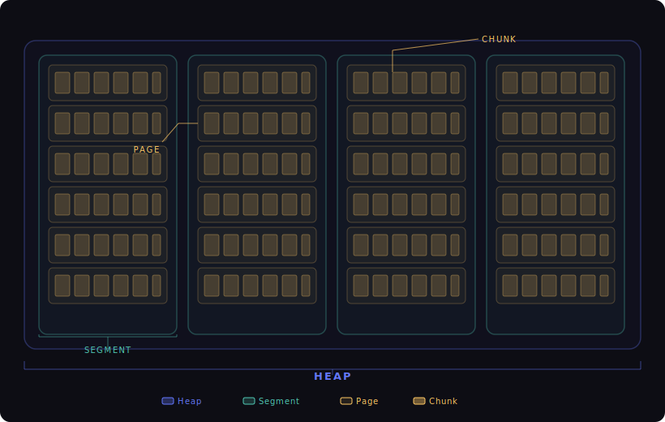
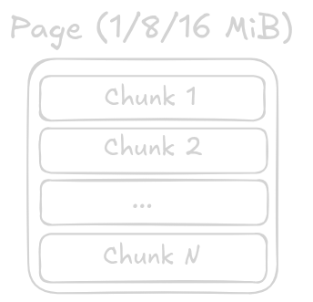
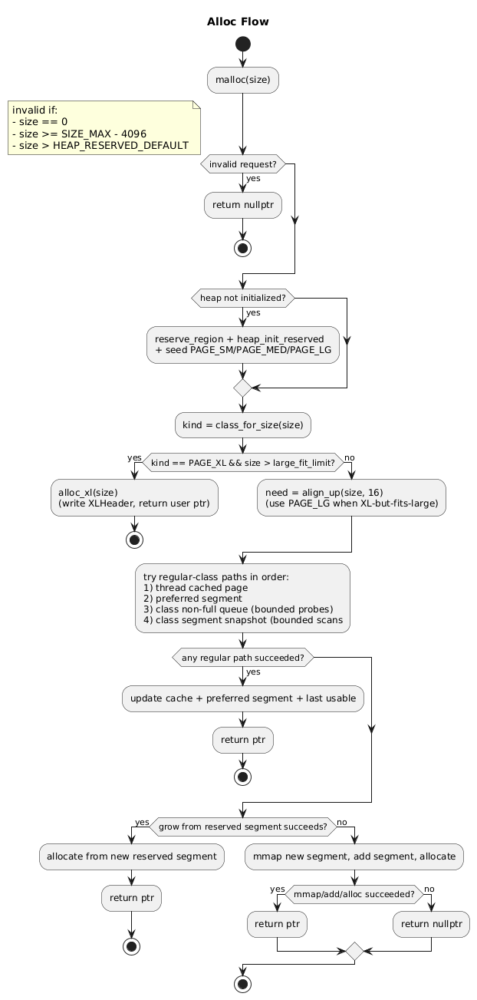
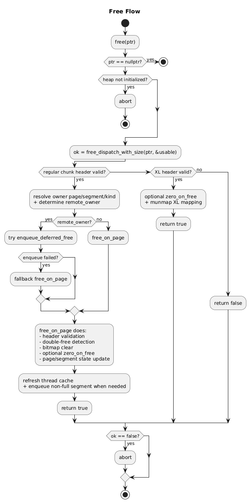

# Zialloc Design 

#### DISCLAIMER: I'm somewhat continuing to work on this project, so there is no promise that this design doc is up-to-date regarding security features and execution path. Layout won't change though.

## Size Model
Zialloc uses fixed size classes for regular allocations plus a directly-mapped XL path.

- Reserved heap virtual address space (default): 100GB
- Segment size / alignment: 128MiB
- Page classes: `SMALL` (1MiB), `MEDIUM` (8MiB), `LARGE` (16MiB), `XL` (direct mapping)
- Chunk size thresholds used for class selection: `512KiB - 16B` (small), `4MiB - 16B` (medium), `8MiB - 16B` (large), above this threshold is XL

Regular-sized requests are bucketed/aligned before placement:
- XL path uses 16-byte alignment.
- Small/Medium/Large classes use a normalized chunk model: round request to at least 16, then round up to next power-of-two, then clamp to class cap.
- Final stride in page = `align_up(normalized_request + inline_header, 16)`.

## Heap Layout
At initialization, zialloc reserves a large vmem region (currently 100GB) and commits segments from it on demand (128MiB). It immediately seeds one segment each for small, medium, and large classes.

### Hierarchy

Each segment is classed by size, meaning all pages in that segment have the same page size.
- Small segment: 1MiB pages
- Medium segment: 8MiB pages
- Large segment: 16MiB pages

Each page is then subdivided into fixed-size chunk slots for that page instance, allowing us to avoid any sort of coalescing logic and worrying about potential fragmentation.
Within one page, all slots have identical stride/usable size and allocation state is tracked with a bitmap.

XL allocations semi-bypass the page/segment class system and are mmapped as standalone mappings with inline XL headers.

Metadata model is entirely allocator-owned(OOL):
- Chunks can resolve their owning page and slot idx using pointer arithmetic on themselves
- Per-page metadata: bitmap, used counts, owner TID, deferred-free ring
- Per-segment metadata: class, page array, full-page count, chunk-geometry lock-in, integrity key/canary
- XL metadata is inline in front of returned pointer (`XLHeader`)

## Allocation Workflow
Allocation starts with API wrappers (`malloc`, `calloc`, `realloc`) and then goes through `HeapState::allocate(size)`.

Main behavior:
- `malloc/calloc/realloc` ensure heap init has happened, then validate request size.
- Size class is computed (`SM/MD/LG/XL`) using configured chunk-class thresholds.
- Even if classified as XL, there is a second chance for large-page fit: if request can still fit a large-page chunk geometry (`<= LARGE_PAGE_SIZE - sizeof(ChunkHeader)`), allocator reroutes to large class; otherwise true XL mapping is used.
- Non-XL fast path is searching thread-local cached pages by class. If the executing thread contains a page that matches/satisfies the requested allocation size, it will return that since this is still faster than following the next path.
- Next path is searching a thread-local preferred segment (there are multiple; sorted by class).
- Next path is a shard queue of known non-full segments.
- Next path is a bounded scan of same size classed segments.
- Slow path grows heap by carving another segment out of our pre-reserved virtual address space.
- The final fallback mmaps a new segment-aligned mapping if the current reserved region cannot satisfy the request.

### Bitmap/chunk behavior
The chunk allocator inside a page is bitmap driven:
- Page tracks a `used_bitmap` where 1 = in use and 0 = free.
- Allocation searches from a `hint`, finds the first zero bit, marks it, writes a chunk header, and returns a pointer after the header to the user.
- Free validates header/magic/owner/slot, clears the bit, decrements used count, and updates `first_hint` for future faster reuse.
- Double free detection is possible by seeing if a bitmap bit is already clear and aborting.

### Alloc flow

## Free Workflow
Free enters through `free()` and dispatches to `HeapState::free_ptr(ptr, usable_out)`.
Its important to note that 'freeing' here doesn't mean releasing memory to the OS. It just means undoing physical mappings. 

Main behavior:
- Null free is ignored.
- For regular allocations, inline header is parsed (`ChunkHeader`) and magic value is checked (`CHUNK_MAGIC`) for corruption - an invalid state would abort().
- Owning page/segment is resolved from header pointer links.
- If freeing thread is not page owner thread, allocator attempts a deferred enqueue into page-local lock-free ring first.
- If deferred enqueue fails (queue full/contention), it falls back to direct free on page.
- Deferred frees are drained by owner-side allocation path opportunistically whenever the queue pressure is moderately high.
- Chunk "free()" itself is just a bitmap bit clear + used chunk count decrement (+ optional zero-on-free).
- For XL pointers, allocator checks `XL_MAGIC`, optionally zeroes payload, and unmaps entire mapping.
- Invalid/untracked pointers are going to report failure from dispatch API and the caller will abort.
- Thread cache is then updated to track the current page for faster future hits.

### Deferred-free ring unintended bonus
The Deffered-free queue is a bounded per-page ring used to defer remote-thread mutation of pages it doesn't own. This gives us a cheeky capability for detecting UAFs (if checks are enabled) and can delay reuse thus acting as a pseudo temporal quarantining mechanism by preventing any writes to pointers currently in the queue.

### Free flow

## Security Strategy
Zialloc uses a few different integrity checks plus optional hardening toggles...

Current controls/checks:
- Pointer/header ownership checks before free and usable-size operations
- Abort-on-corruption for invalid headers, bad transitions, and detected double frees
- Segment integrity key/canary check in validation path
- Optional zero-on-free memory scrubbing
- Optional UAF check path in `usable_size` (aborts if the slot is no longer marked as allocated)

## Known Limits
- Heap layout itself isn't optimal
- Metadata lookup/access isn't as good as radix trees.
- XL allocations are direct mapped and behavior differs from class-segmented allocations.
- Segment classing and fixed chunk geometry per segment trade memory efficiency for predictable behavior and scan reduction.
- Deferred ring for cross-thread frees is capped and may fall back to direct page free.
- Thread-aware fast paths improve latency butadd complexity and state coupling.

## Source Map
- API entrypoints, init/teardown, stats:
  - `zialloc/alloc.cpp`
- Core allocator internals (heap/segment/page/cache/deferred free):
  - `zialloc/segments.cpp`
- OS mapping/protection/reservation wrappers:
  - `zialloc/os.cpp`
- Shared constants/macros/enums:
  - `zialloc/types.h`
  - `zialloc/mem.h`
- Memory interface declarations used across units:
  - `zialloc/zialloc_memory.hpp`

## API Surface
Supported APIs:
- `malloc`
- `free`
- `realloc`
- `calloc`
- `usable_size`
- `print_stats`
- `validate_heap`
- `get_stats`
- `init`
- `teardown`

currently not implemented:
- `memalign`
- `aligned_alloc`
- `free_sized`
- `realloc_array`
- `bulk_free`

---